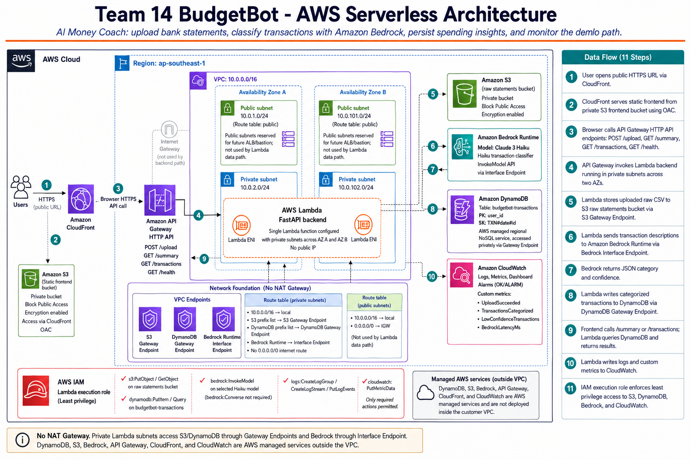

# W7 Evidence Pack — Team 14 BudgetBot — Bản Tiếng Việt

## 1. Trang Bìa

| Mục | GiĂ¡ trị |
|---|---|
| NhĂ³m | Team 14 / G14 |
| Domain | FinTech — AI Money Coach / BudgetBot |
| Live public URL | https://your-domain.example.com |
| CloudFront URL | https://xxxxxxxxxxxx.cloudfront.net |
| API endpoint | https://xxxxxxxxxx.execute-api.ap-southeast-1.amazonaws.com |
| GitHub repo | https://github.com/your-github-username/team14-repo |
| AWS account | 123456789012 |
| AWS region | ap-southeast-1 |
| CloudFormation stack | team14-budgetbot-iac |
| Tổng chi phĂ­ | TODO: Ä‘iền từ Cost Explorer screenshot sĂ¡ng demo |
| Hard cap | $100/nhĂ³m |
| Budget alert | W7-Team14-HardCap-100USD, monthly cost budget $100 |
| Email SNS Ä‘Ă£ confirm | your-email@example.com |

### Artifact Bắt Buộc

| Artifact | Trạng thĂ¡i | Bằng chứng |
|---|---:|---|
| Live HTTPS URL | Xong | `https://your-domain.example.com` trả HTTP 200 qua CloudFront |
| GitHub repo | Xong | `https://github.com/your-github-username/team14-repo` |
| SÆ¡ đồ kiến trĂºc cuối | Xong | `docs/architecture.png` |
| Evidence Pack | Xong | `docs/W7_evidence.md` vĂ  `docs/W7_evidence.vi.md` |
| Video demo | TODO | ThĂªm `docs/demo.mp4` hoặc link YouTube unlisted |
| Slides PDF | TODO | ThĂªm `docs/slides.pdf` |
| Teardown confirmation | ÄĂ£ lĂªn kế hoạch | `docs/teardown_confirmation.md` sau hạn Sun 1/6 EOD |

## 2. Pitch VĂ  Tầm Nhìn

BudgetBot lĂ  má»™t AI Money Coach giĂºp người dĂ¹ng hiểu nhanh tiền của mình Ä‘Ă£ Ä‘i Ä‘Ă¢u. Người dĂ¹ng upload sao kĂª ngĂ¢n hĂ ng dạng CSV; BudgetBot lÆ°u file gốc, phĂ¢n loại từng giao dịch bằng Amazon Bedrock, lÆ°u kết quả vĂ o DynamoDB, hiển thị summary theo category vĂ  Ä‘Æ°a cĂ¡c giao dịch low-confidence vĂ o review queue.

Người dĂ¹ng mục tiĂªu lĂ  sinh viĂªn, người má»›i Ä‘i lĂ m, freelancer vĂ  chủ doanh nghiệp nhỏ cần nhìn nhanh tình hình chi tiĂªu mĂ  khĂ´ng muốn tá»± gắn nhĂ£n từng dĂ²ng giao dịch. Sản phẩm tÆ°Æ¡ng tá»± ngoĂ i đời gồm Money Lover, YNAB, Spendee, Monzo/Revolut spending insights vĂ  Cake by VPBank. Domain nĂ y quan trọng vì dữ liệu tĂ i chĂ­nh thá»±c tế rất bẩn: mĂ´ tả giao dịch ngắn, tĂªn merchant khĂ´ng thống nhất, nhiều dĂ²ng mÆ¡ hồ hoặc khĂ´ng đủ thĂ´ng tin. Vì vậy AI chỉ hữu Ă­ch khi hệ thống cĂ³ confidence score vĂ  cho phĂ©p người dĂ¹ng sá»­a kết quả khĂ´ng chắc chắn.

### Demo Flow

1. Trainer mở `https://your-domain.example.com`.
2. Upload `sample_data/bank_statement_q2_2026.csv`.
3. Lambda lÆ°u raw CSV vĂ o S3.
4. Lambda gá»­i mĂ´ tả giao dịch sang Amazon Bedrock InvokeModel.
5. Bedrock trả JSON-only gồm `category` vĂ  `confidence`.
6. Lambda lÆ°u categorized transactions vĂ o DynamoDB.
7. UI refresh summary, transaction list, AI performance, failure cases vĂ  review queue.
8. Sau khi refresh browser, dữ liệu vẫn cĂ²n vì state được lÆ°u trong DynamoDB.

## 3. Kiến TrĂºc



### TĂ³m Tắt Kiến TrĂºc

Luồng runtime:

`Users -> Route 53 -> CloudFront HTTPS -> private S3 frontend -> API Gateway HTTP API -> Lambda FastAPI -> S3 raw bucket / Bedrock Runtime / DynamoDB / CloudWatch`

Luồng deployment:

`Developer push -> GitHub Actions -> pytest -> build Lambda zip -> S3 artifact bucket -> CloudFormation deploy -> S3 frontend sync -> CloudFront invalidation`

### 7 Mandatory Capabilities

| # | Capability | Service Ä‘Ă£ triển khai | Bằng chứng / Resource | LĂ½ do chọn |
|---:|---|---|---|---|
| 1 | User-Facing Entry | Route 53 + CloudFront + S3 static frontend + API Gateway HTTP API | `your-domain.example.com`, CloudFront `XXXXXXXXXXXX`, API `xxxxxxxxxx` | CloudFront cung cấp HTTPS public vĂ  truy cập S3 private qua OAC. API Gateway HTTP API rẻ vĂ  Ä‘Æ¡n giản hÆ¡n REST API cho Lambda proxy. |
| 2 | Application Compute | AWS Lambda chạy FastAPI qua Mangum | `team14-budgetbot-cfn-backend`, Python 3.12, 512 MB, timeout 30s | Upload CSV vĂ  classify lĂ  request-driven workload. Lambda khĂ´ng cĂ³ idle server cost vĂ  deploy nhanh trong hackathon 48 giờ. |
| 3 | AI / ML Feature | Amazon Bedrock Runtime InvokeModel | `AI_MODEL_ID=apac.amazon.nova-micro-v1:0` | BudgetBot cần classify từng transaction, khĂ´ng cần RAG. InvokeModel Ä‘Æ¡n giản vĂ  tiết kiệm hÆ¡n Knowledge Base. |
| 4 | Data Persistence | DynamoDB | `team14-budgetbot-cfn-transactions`, PK `user_id`, SK `sk`, PAY_PER_REQUEST, PITR enabled | Access pattern lĂ  query theo user/month vĂ  summary category. DynamoDB giảm vận hĂ nh vĂ  trĂ¡nh chi phĂ­ RDS instance/proxy. |
| 5 | Object Storage | Amazon S3 | raw bucket `team14-budgetbot-cfn-raw-123456789012-ap-southeast-1`, frontend bucket `team14-budgetbot-cfn-frontend-123456789012-ap-southeast-1`, artifact bucket `team14-budgetbot-artifacts-123456789012-ap-southeast-1` | S3 phĂ¹ hợp để lÆ°u raw CSV, static frontend vĂ  Lambda artifact. |
| 6 | Network Foundation | VPC, private subnets 2 AZ, security groups, VPC endpoints, khĂ´ng dĂ¹ng NAT Gateway | VPC `vpc-044f26a2a760491ba`; private subnets `subnet-0acedaa53e5480c96`, `subnet-0f404f193e6534efd`; endpoints cho S3, DynamoDB, Bedrock Runtime, CloudWatch Monitoring | Lambda khĂ´ng cĂ³ public IP. Private subnets gọi AWS services qua endpoint để giảm chi phĂ­ vĂ  giữ traffic private. |
| 7 | Identity & Access | IAM least-privilege Lambda execution role | `arn:aws:iam::123456789012:role/team14-budgetbot-cfn-lambda-role` | Rule yĂªu cầu IAM least privilege. User login lĂ  optional, nĂªn app dĂ¹ng demo `X-User-Id` thay vì tốn thời gian triển khai Cognito đầy đủ. |

### Optional Capability ÄĂ£ Chọn

Team 14 chọn **Optional #8 — Full Observability**.

| YĂªu cầu | Triển khai | Trạng thĂ¡i |
|---|---|---:|
| CloudWatch dashboard | `team14-budgetbot-cfn-observability` | Xong |
| Custom metric qua `PutMetricData` | `UploadSucceeded`, `TransactionsCategorized`, `LowConfidenceTransactions`, `BedrockLatencyMs` trong namespace `BudgetBot/Team14` | Xong |
| Alarm ở OK/ALARM | `team14-budgetbot-cfn-low-confidence-transactions`, state `OK`, `TreatMissingData=notBreaching` | Xong |
| Saved Logs Insights query | `team14-budgetbot-cfn/upload-classification-path`, id `81030937-11c7-4d22-900e-b13f51a6c9d8` | Xong |

### Bonus Paths ÄĂ£ LĂ m

| Bonus Path | Bằng chứng |
|---|---|
| B. CI/CD pipeline | `.github/workflows/build-and-deploy.yml`; latest runs trĂªn `main` Ä‘Ă£ success |
| C. Custom domain + HTTPS | Route 53 `your-domain.example.com`, ACM certificate ở `us-east-1`, CloudFront alias |
| E. IaC full coverage | `infrastructure/cloudformation.yaml` tạo VPC, endpoints, S3, CloudFront, DynamoDB, IAM, Lambda, API Gateway, CloudWatch dashboard/alarm/query |
| H. Cost under $30 | Chờ Cost Explorer screenshot cuối vĂ  teardown sạch |

### Quyết Định Service ChĂ­nh

| Quyết định | Lá»±a chọn | PhÆ°Æ¡ng Ă¡n cĂ¢n nhắc | LĂ½ do |
|---|---|---|---|
| Compute | Lambda | ECS/Fargate hoặc EC2 | Lambda hợp vá»›i request upload/API, khĂ´ng cĂ³ idle cost. ECS/EC2 thĂªm vận hĂ nh server/container khĂ´ng cần thiết cho demo. |
| API entry | API Gateway HTTP API | REST API hoặc ALB | HTTP API đủ cho Lambda proxy routes vĂ  rẻ hÆ¡n REST API. ALB phĂ¹ hợp hÆ¡n cho service chạy lĂ¢u. |
| Frontend | S3 + CloudFront | Amplify hoặc backend-served frontend | HTML/JS static đủ cho demo. CloudFront giải quyết HTTPS vĂ  caching. |
| AI path | Bedrock InvokeModel | Bedrock KB/Agent | BudgetBot classify transaction rows, không retrieve knowledge từ tài liệu upload. |
| Model | Amazon Nova Micro | Model lá»›n hÆ¡n nhÆ° Claude/Sonnet | Nova Micro rẻ hÆ¡n vĂ  đủ cho category classification khi cĂ³ JSON-only prompt + review queue fallback. |
| Database | DynamoDB | RDS PostgreSQL | DynamoDB trĂ¡nh chi phĂ­ instance vĂ  Ä‘Ă¡p ứng access pattern user/month. Aggregation trong app chấp nhận được ở quy mĂ´ hackathon. |
| Network | KhĂ´ng NAT, dĂ¹ng VPC endpoints | NAT Gateway | S3/DynamoDB gateway endpoints miá»…n phĂ­; Bedrock/CloudWatch interface endpoints rẻ hÆ¡n NAT cho traffic AWS-only. |
| Identity | IAM least privilege + demo user header | Full Cognito flow | Rule yĂªu cầu IAM least privilege; Cognito optional. Bỏ Cognito giĂºp giữ scope Ä‘Ăºng 48 giờ. |
| Observability | CloudWatch dashboard/metrics/alarm/query | Monitoring ngoĂ i AWS | CloudWatch native, Ä‘Ă£ học W1-W6, Ä‘Ă¡p ứng trá»±c tiếp Optional #8. |

## 4. Ká»· Luật Chi PhĂ­

### Safety Bắt Buộc

| YĂªu cầu | Trạng thĂ¡i | Bằng chứng |
|---|---:|---|
| AWS Budget alert | Xong | `W7-Team14-HardCap-100USD`, monthly COST budget $100 |
| SNS email confirmed | Xong | `your-email@example.com`, subscription ARN Ä‘Ă£ confirm |
| Cost Anomaly Detection | Xong | Monitor `Default-Services-Monitor`; gắn `docs/evidence_screenshots/cost/03_cost_anomaly_detection.png` |
| Tagging convention | Xong | `Project=W7Capstone`, `Team=G14`, `Owner=Team14`, `Environment=hackathon` trong CloudFormation resources |
| Bedrock access | Xong | Lambda health trả `ai=bedrock`; InvokeModel chạy qua app Ä‘Ă£ deploy |
| Cost Explorer screenshots | TODO | Day 1 EOD, Day 2 EOD, Friday pre-demo |

### Screenshot Cần Gắn VĂ o Evidence

| Screenshot | File cần thĂªm | Ghi chĂº |
|---|---|---|
| Day 1 EOD Cost Explorer | `docs/evidence_screenshots/cost/04_cost_explorer_day1_eod.png` | Group by Service, filter theo Team/G14 nếu cost allocation tag Ä‘Ă£ active |
| Day 2 EOD Cost Explorer | `docs/evidence_screenshots/cost/05_cost_explorer_day2_eod.png` | CĂ³ tổng chi phĂ­ |
| Friday pre-demo Cost Explorer | `docs/evidence_screenshots/cost/06_cost_explorer_friday_predemo.png` | Số chĂ­nh thức trÆ°á»›c demo |
| Budget alert | `docs/evidence_screenshots/cost/01_budget_alert.png` | Show budget $100 / threshold $80 |
| SNS confirmation | `docs/evidence_screenshots/cost/02_sns_confirmed.png` | Show email subscription confirmed |
| Cost Anomaly Detection | `docs/evidence_screenshots/cost/03_cost_anomaly_detection.png` | Show monitor/subscription active |

### Cost Drivers Dự Kiến

| Driver | Vì sao phĂ¡t sinh | CĂ¡ch kiểm soĂ¡t |
|---|---|---|
| Bedrock Runtime | AI classification khi upload vĂ  chạy accuracy test | DĂ¹ng Nova Micro, batch classification, prompt ngắn JSON-only, trĂ¡nh loop model đắt |
| CloudFront + S3 | Public frontend, raw CSV, Lambda artifacts | Static site vĂ  file volume thấp |
| VPC Interface Endpoints | Lambda private gọi Bedrock Runtime vĂ  CloudWatch Monitoring | TrĂ¡nh NAT Gateway; S3/DynamoDB dĂ¹ng gateway endpoints miá»…n phĂ­ |
| DynamoDB | LÆ°u transaction state | PAY_PER_REQUEST, item count nhỏ, khĂ´ng provision capacity |
| Lambda + API Gateway | Backend compute vĂ  API entry | Serverless, khĂ´ng cĂ³ idle EC2/RDS cost |

### Ghi Nhận Cost

Khi soạn evidence, AWS Cost Explorer trả `DataUnavailableException`, thường xảy ra khi Cost Explorer má»›i bật hoặc dữ liệu ngĂ y chÆ°a ingest xong. TrÆ°á»›c khi ná»™p, cần thay ghi chĂº nĂ y bằng tổng chi phĂ­ sĂ¡ng demo vĂ  top 3 cost drivers từ Cost Explorer.

## 5. Bảo Mật

### Security Controls ÄĂ£ Triển Khai

| Mảng | Triển khai | Bằng chứng |
|---|---|---|
| Root account safety | Root MFA lĂ  pre-flight requirement | Gắn `docs/evidence_screenshots/security/01_root_mfa_enabled.png` từ account owner |
| HTTPS public entry | Route 53 + CloudFront + ACM certificate | `your-domain.example.com`; ACM cert `arn:aws:acm:us-east-1:123456789012:certificate/5aece9cc-fd4b-4ebc-a6a5-24ab429455de`; CloudFront TLS minimum `TLSv1.2_2021` |
| Frontend bucket private | S3 Block Public Access + CloudFront OAC | `team14-budgetbot-cfn-frontend-123456789012-ap-southeast-1`, OAC `E3U013UCJVZJJW` |
| Raw statement storage | S3 Block Public Access + SSE-S3 | `team14-budgetbot-cfn-raw-123456789012-ap-southeast-1`, AES256 encryption |
| Data encryption | DynamoDB SSE enabled + PITR enabled | `team14-budgetbot-cfn-transactions`, `SSE=ENABLED`, continuous backups `ENABLED` |
| Network isolation | Lambda trong private subnets, khĂ´ng public IP, private route table khĂ´ng cĂ³ internet default route | private subnets `subnet-0acedaa53e5480c96`, `subnet-0f404f193e6534efd`; khĂ´ng NAT Gateway |
| Least privilege | Lambda role chỉ cĂ³ action cần thiết | `BudgetBotLambdaLeastPrivilegePolicy` |
| Cost safety | Budget + SNS + Cost Anomaly Detection | Budget `W7-Team14-HardCap-100USD`; SNS confirmed |

### IAM Scope Của Lambda

Lambda execution role chỉ cho phĂ©p cĂ¡c action cần cho demo path:

- S3 raw bucket: `s3:PutObject`, `s3:GetObject`, `s3:ListBucket`
- DynamoDB transactions table: `dynamodb:PutItem`, `dynamodb:GetItem`, `dynamodb:Query`, `dynamodb:UpdateItem`
- Bedrock: `bedrock:InvokeModel` trĂªn Nova Micro inference profile/foundation model Ä‘Ă£ chọn vĂ  má»™t fallback model ARN được liệt kĂª rõ
- CloudWatch Logs: `logs:CreateLogGroup`, `logs:CreateLogStream`, `logs:PutLogEvents`
- CloudWatch custom metrics: `cloudwatch:PutMetricData` chỉ cho namespace `BudgetBot/Team14`
- Lambda VPC attachment: EC2 network-interface actions cần cho Lambda ENI

Trade-off: má»™t số quyền nhÆ° CloudWatch metrics vĂ  Lambda ENI vẫn cần `Resource: "*"`, vì AWS API Ä‘Ă³ khĂ´ng há»— trợ resource-level scoping giống S3/DynamoDB. Điều kiện namespace giá»›i hạn phần CloudWatch metric.

## 6. Monitoring

Team 14 triển khai **Full Observability**.

### CloudWatch Dashboard

| Mục | GiĂ¡ trị |
|---|---|
| Dashboard name | `team14-budgetbot-cfn-observability` |
| Dashboard ARN | `arn:aws:cloudwatch::123456789012:dashboard/team14-budgetbot-cfn-observability` |
| Region | ap-southeast-1 |
| Widgets | BudgetBot demo path metrics |

### Custom Metrics

| Metric | Namespace | Unit | Ý nghÄ©a |
|---|---|---|---|
| `UploadSucceeded` | `BudgetBot/Team14` | Count | Má»™t upload CSV hoĂ n tất thĂ nh cĂ´ng |
| `TransactionsCategorized` | `BudgetBot/Team14` | Count | Số transaction Ä‘Ă£ classify vĂ  persist |
| `LowConfidenceTransactions` | `BudgetBot/Team14` | Count | Số classification low-confidence được Ä‘Æ°a vĂ o review |
| `BedrockLatencyMs` | `BudgetBot/Team14` | Milliseconds | Latency classify cho batch upload |

### Alarm

| Mục | GiĂ¡ trị |
|---|---|
| Alarm name | `team14-budgetbot-cfn-low-confidence-transactions` |
| State khi validate | `OK` |
| Metric | `LowConfidenceTransactions` |
| Threshold | `>= 1` trong 300 giĂ¢y |
| Treat missing data | `notBreaching` |
| Vì sao quan trọng | BĂ¡o rủi ro chất lượng classification khi upload cĂ³ transaction low-confidence. |

### Logs Insights Query

Saved query:

```sql
fields @timestamp, @message
| filter @message like /bedrock_classification_result|cloudwatch_put_metric_data_failed|upload|summary|review/
| sort @timestamp desc
| limit 50
```

Bằng chứng:

- Query definition name: `team14-budgetbot-cfn/upload-classification-path`
- Query definition id: `81030937-11c7-4d22-900e-b13f51a6c9d8`
- Log group: `/aws/lambda/team14-budgetbot-cfn-backend`

## 6.5 Đo Lường VĂ  Quyết Định

### DECISION 1 — Chọn DynamoDB Thay Vì RDS PostgreSQL

**QUYẾT ĐỊNH:** DĂ¹ng DynamoDB PAY_PER_REQUEST table `team14-budgetbot-cfn-transactions` để lÆ°u categorized transactions.

**PHƯƠNG ÁN CĂ‚N NHẮC:**

- RDS PostgreSQL: mạnh hÆ¡n về SQL aggregation, nhÆ°ng cĂ³ chi phĂ­ instance, subnet group, backup lifecycle vĂ  connection management.
- SQLite/local file: tốt cho local dev, nhÆ°ng khĂ´ng phĂ¹ hợp deployed Lambda vì khĂ´ng phải shared persistent state.

**ĐO LƯỜNG:**

- Table state: `ACTIVE`.
- Item count khi validate: `91`.
- Billing mode: `PAY_PER_REQUEST`.
- Key schema: `user_id` hash key + `sk` range key.
- Persistent state test: upload data, refresh browser, gọi `GET /transactions` hoặc `GET /summary`, dữ liệu vẫn đọc được từ DynamoDB.

**BẰNG CHỨNG:**

- AWS CLI: `aws dynamodb describe-table --table-name team14-budgetbot-cfn-transactions`
- CloudFormation: `TransactionsTable` trong `infrastructure/cloudformation.yaml`
- API routes: `GET /transactions`, `GET /summary`, `GET /stats`

**TRADE-OFF CHẤP NHẬN:**

DynamoDB khĂ´ng cĂ³ SQL `GROUP BY`, nĂªn app aggregate summary trong application code sau khi query transactions của user. Vá»›i sample hackathon, trade-off nĂ y hợp lĂ½ vĂ  trĂ¡nh idle cost của RDS. Nếu scale lá»›n hÆ¡n, nhĂ³m sẽ thĂªm GSI hoặc precomputed monthly summary items.

### DECISION 2 — Amazon Bedrock InvokeModel Với Nova Micro Batch Classification

**QUYẾT ĐỊNH:** DĂ¹ng Amazon Bedrock Runtime `InvokeModel` vá»›i `apac.amazon.nova-micro-v1:0` để classify transaction. Prompt bắt model trả JSON-only gồm `category` vĂ  `confidence`.

**PHƯƠNG ÁN CĂ‚N NHẮC:**

- Local rule-based classifier: khĂ´ng tốn AI cost nhÆ°ng yếu vá»›i merchant chÆ°a thấy nhÆ° `Vietnam Airlines HAN-SGN`, `KFC District 1`, `Cursor Pro` vĂ  opaque POS rows.
- Bedrock Knowledge Base/Agent: hợp vá»›i document retrieval, nhÆ°ng BudgetBot lĂ  classification trĂªn CSV rows, khĂ´ng phải RAG.
- Model lá»›n hÆ¡n: cĂ³ thể tốt hÆ¡n nhÆ°ng tốn token cost hÆ¡n, chÆ°a cần cho scoped demo.

**ĐO LƯỜNG:**

- Labeled test set local: 40 transactions.
- Accuracy report trong repo: `28/40 = 70.0%` cho baseline path được Ä‘Ă¡nh giĂ¡.
- Known-brand improvement: LocalAI `0/7` trĂªn unseen brands Ä‘Ă£ liệt kĂª; Bedrock Æ°á»›c tĂ­nh khoảng `6/7`.
- Upload metric validation: sample upload publish `TransactionsCategorized` vĂ  `LowConfidenceTransactions`.
- Low-confidence fallback: dĂ²ng cĂ³ `confidence="low"` xuất hiện trong `GET /review-queue`.

**BẰNG CHỨNG:**

- `docs/accuracy_report.txt`
- `docs/failure_cases.md`
- `src/adapters/ai.py` JSON-only prompts
- `src/handlers.py` review queue vĂ  custom metrics
- CloudWatch metric `LowConfidenceTransactions`

**TRADE-OFF CHẤP NHẬN:**

Hệ thống khĂ´ng claim AI tá»± Ä‘á»™ng Ä‘Ăºng 100%. Thay vĂ o Ä‘Ă³, app hiển thị confidence vĂ  Ä‘Æ°a case khĂ´ng chắc chắn vĂ o review queue. CĂ¡ch nĂ y an toĂ n hÆ¡n cho dữ liệu tĂ i chĂ­nh.

### DECISION 3 — KhĂ´ng DĂ¹ng NAT Gateway, DĂ¹ng VPC Endpoints

**QUYẾT ĐỊNH:** Chạy Lambda trong private subnets ở 2 AZ vĂ  truy cập AWS services qua VPC endpoints thay vì NAT Gateway.

**PHƯƠNG ÁN CĂ‚N NHẮC:**

- NAT Gateway: Ä‘Æ¡n giản cho internet egress chung, nhÆ°ng cĂ³ hourly cost vĂ  data processing cost.
- Lambda ngoĂ i VPC: network Ä‘Æ¡n giản hÆ¡n, nhÆ°ng yếu hÆ¡n về evidence Network Foundation vĂ  private service access.

**ĐO LƯỜNG:**

- VPC `vpc-044f26a2a760491ba`.
- Private subnets 2 AZ: `10.0.2.0/24` vĂ  `10.0.102.0/24`.
- S3 Gateway Endpoint: `vpce-0fa20050fb908c907`.
- DynamoDB Gateway Endpoint: `vpce-021f8d076fea679f5`.
- Bedrock Runtime Interface Endpoint: `vpce-0cf470982a94fec03`.
- CloudWatch Monitoring Interface Endpoint: `vpce-0e765088be49cb20d`.

**BẰNG CHỨNG:**

- CloudFormation resources `S3GatewayEndpoint`, `DynamoDbGatewayEndpoint`, `BedrockRuntimeEndpoint`, `CloudWatchMonitoringEndpoint`.
- Private route table cĂ³ local route vĂ  Gateway Endpoint routes; khĂ´ng cĂ³ NAT route `0.0.0.0/0`.

**TRADE-OFF CHẤP NHẬN:**

Interface endpoints cĂ³ hourly cost theo AZ, nhÆ°ng giữ backend private vĂ  trĂ¡nh NAT Gateway cost. Vì app chỉ gọi AWS services, khĂ´ng cần internet egress chung.

## 7. BĂ i Học RĂºt Ra

BĂ i học lá»›n nhất lĂ  má»™t AI SaaS demo chạy được phụ thuá»™c nhiều vĂ o kiểm soĂ¡t scope vĂ  evidence, khĂ´ng phải thĂªm thật nhiều tĂ­nh năng. BudgetBot bắt đầu từ starter app, nhÆ°ng nhĂ³m phải Ä‘Æ°a ra cĂ¡c quyết định triển khai thật: Lambda thay vì ECS/EC2, DynamoDB thay vì RDS, Bedrock InvokeModel trá»±c tiếp thay vì Knowledge Base, vĂ  VPC endpoints thay vì NAT Gateway. CĂ¡c lá»±a chọn nĂ y giĂºp hệ thống đủ nhỏ để ship, nhÆ°ng vẫn cover đủ 7 mandatory capabilities.

Vấn đề sản phẩm khĂ³ nhất lĂ  uncertainty trong classification. Má»™t số transaction dá»… Ä‘oĂ¡n nhÆ° coffee shop hoặc airline, nhÆ°ng mĂ´ tả nhÆ° `Unknown merchant POS` khĂ´ng đủ tĂ­n hiệu để model classify chắc chắn. CĂ¡ch xá»­ lĂ½ khĂ´ng phải lĂ  giả định AI luĂ´n Ä‘Ăºng. App trả confidence, Ä‘Æ°a low-confidence rows vĂ o review queue, vĂ  há»— trợ user correction qua `POST /correct`. NhÆ° vậy failure mode của AI trở thĂ nh má»™t workflow minh bạch.

Nếu cĂ³ thĂªm má»™t sprint, nhĂ³m sẽ thĂªm Cognito auth, budget goals theo thĂ¡ng, alert khi category vượt cap, recurring transaction detection vĂ  precomputed monthly summary table cho dataset lá»›n hÆ¡n.

## 8. Kế Hoạch Teardown

Deadline teardown: **Sunday 1/6 EOD**. Commit xĂ¡c nhận vĂ o `docs/teardown_confirmation.md` vĂ  thĂªm screenshot Cost Explorer ngĂ y Monday.

### Thứ Tự Teardown

1. Disable hoặc remove custom DNS aliases nếu xĂ³a CloudFront.
2. Delete CloudFormation stack `team14-budgetbot-iac`.
3. Nếu stack deletion fail vì S3, empty cĂ¡c bucket nĂ y trÆ°á»›c:
   - `team14-budgetbot-cfn-frontend-123456789012-ap-southeast-1`
   - `team14-budgetbot-cfn-raw-123456789012-ap-southeast-1`
   - `team14-budgetbot-artifacts-123456789012-ap-southeast-1`
4. Delete CloudFront distribution `XXXXXXXXXXXX` sau khi disable nếu cần.
5. Delete API Gateway `xxxxxxxxxx`.
6. Delete Lambda function `team14-budgetbot-cfn-backend`.
7. Delete DynamoDB table `team14-budgetbot-cfn-transactions` nếu cĂ²n.
8. Delete CloudWatch dashboard, alarm, saved query vĂ  Lambda log group.
9. Delete VPC endpoints, subnets, route tables, security groups, internet gateway vĂ  VPC sau cĂ¹ng.
10. Review Route 53 hosted zones vĂ  xĂ³a hosted zone `your-domain.example.com` dÆ° nếu khĂ´ng cần.
11. Verify Cost Explorer vĂ o Monday 2/6 vĂ  commit screenshot.

### Lệnh Teardown Khởi Điểm

```bash
aws cloudformation delete-stack \
  --profile hackathon \
  --region ap-southeast-1 \
  --stack-name team14-budgetbot-iac

aws cloudformation wait stack-delete-complete \
  --profile hackathon \
  --region ap-southeast-1 \
  --stack-name team14-budgetbot-iac
```

## Appendix A — Lệnh Kiểm Chứng Live

```bash
curl -I https://your-domain.example.com
curl https://xxxxxxxxxx.execute-api.ap-southeast-1.amazonaws.com/health

aws cloudformation describe-stacks \
  --profile hackathon \
  --region ap-southeast-1 \
  --stack-name team14-budgetbot-iac

aws cloudwatch describe-alarms \
  --profile hackathon \
  --region ap-southeast-1 \
  --alarm-names team14-budgetbot-cfn-low-confidence-transactions

aws dynamodb describe-continuous-backups \
  --profile hackathon \
  --region ap-southeast-1 \
  --table-name team14-budgetbot-cfn-transactions
```

## Appendix B — TĂ i Liệu YĂªu Cầu ÄĂ£ DĂ¹ng

Bản Evidence Pack nĂ y được viết theo:

- `W7/W7_project_announcement.md`
- `W7/W7_learner_guide.md`
- `W7/W7_hackathon_rules.txt`
- `W7/W7_cost_estimates.md`
- `W7/starter_apps/README.md`

